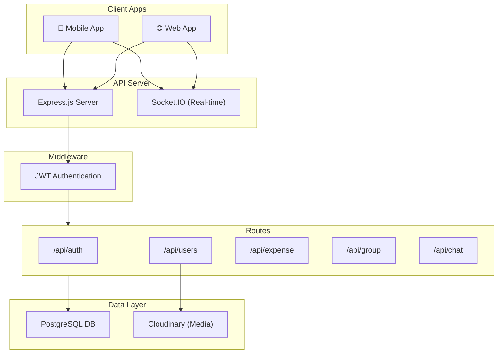

# Expense Manager PSQL - Project Analysis

> **App Name**: Kharcha-app (Expense Manager)  
> **Type**: Node.js/Express.js Backend Server  
> **Database**: PostgreSQL with SSL  
> **Author**: Rishabh

---

## Project Overview

This is a full-featured **expense tracking and financial management** backend server with the following capabilities:

- 💰 **Expense Management**: Add, view, update, delete expenses with filtering/sorting
- 👥 **Group Management**: Create groups, manage members for collaborative expense tracking
- 💬 **Real-time Chat**: End-to-end encrypted messaging with Socket.IO
- 📊 **Financial Analytics**: Budget tracking, income management, weekly charts, category-wise analysis
- 📄 **PDF Reports**: Generate expense reports using Puppeteer
- 🔐 **Authentication**: JWT-based auth with Google OAuth and OTP verification

---

## Architecture



---

## Directory Structure

```
src/
├── index.ts              # Server entry point
├── socket.ts             # Socket.IO configuration
├── constants.ts          # App constants (empty)
├── config/
│   └── cloudinary.ts     # Cloudinary setup
├── database/
│   └── index.ts          # PostgreSQL connection config
├── middlewares/
│   └── authenticate.ts   # JWT verification middleware
├── routes/
│   ├── authRouter.ts     # Authentication routes
│   ├── usersRouter.ts    # User profile routes
│   ├── expenseRouter.ts  # Expense management routes
│   ├── groupRouter.ts    # Group management routes
│   └── chatRouter.ts     # E2E encrypted chat routes
├── controllers/          # Route handlers
├── services/             # Business logic layer
├── utils/
│   ├── auth.ts           # Auth utilities
│   ├── sendMail.ts       # Email (Nodemailer) utility
│   └── sendOtpViaSMS.ts  # Twilio SMS OTP utility
├── templates/
│   └── report-template.html  # PDF report template
└── views/                    # Pug email templates
    ├── otp.pug
    ├── verificationCode.pug
    └── resetPassword.pug
```

---

## API Routes Reference

### 🔐 Authentication (`/api/auth`)

| Method | Endpoint              | Auth | Description               |
| ------ | --------------------- | ---- | ------------------------- |
| POST   | `/signup`             | ❌   | Register new user         |
| POST   | `/login`              | ❌   | Login with email/password |
| POST   | `/signin-with-google` | ❌   | Google OAuth login        |
| POST   | `/send-otp`           | ❌   | Send OTP to email         |
| POST   | `/verify-otp`         | ❌   | Verify OTP                |
| PUT    | `/update-password`    | ✅   | Change password           |

---

### 👤 Users (`/api/users`)

| Method | Endpoint              | Auth | Description                   |
| ------ | --------------------- | ---- | ----------------------------- |
| GET    | `/me`                 | ✅   | Get current user profile      |
| PUT    | `/update-profile`     | ✅   | Update profile info           |
| POST   | `/upload-profile-pic` | ✅   | Upload profile image (Multer) |
| GET    | `/profile-pic`        | ✅   | Get profile picture URL       |

---

### 💰 Expenses (`/api/expense`)

| Method | Endpoint                    | Auth | Description                                         |
| ------ | --------------------------- | ---- | --------------------------------------------------- |
| POST   | `/add`                      | ✅   | Add new expense                                     |
| GET    | `/`                         | ✅   | List expenses (with filtering, pagination, sorting) |
| POST   | `/update`                   | ✅   | Update expense                                      |
| POST   | `/delete/:expenseId`        | ✅   | Delete expense                                      |
| POST   | `/details/:expenseId`       | ✅   | Get expense details                                 |
| GET    | `/getWeekChart`             | ✅   | Weekly expense chart data                           |
| GET    | `/getExpenseByCategory`     | ✅   | Category-wise breakdown                             |
| POST   | `/add-budget`               | ✅   | Set monthly budget                                  |
| POST   | `/add-income`               | ✅   | Set monthly income                                  |
| GET    | `/get-user-finance-summary` | ✅   | Financial summary for month                         |
| GET    | `/get-home-summary`         | ✅   | Home dashboard data                                 |
| GET    | `/generate-report`          | ✅   | Generate PDF report                                 |

---

### 👥 Groups (`/api/group`)

| Method | Endpoint         | Auth | Description          |
| ------ | ---------------- | ---- | -------------------- |
| GET    | `/list`          | ❌   | Get user's groups    |
| POST   | `/details/:id`   | ❌   | Get group details    |
| POST   | `/create`        | ❌   | Create new group     |
| POST   | `/addMembers`    | ❌   | Add members to group |
| POST   | `/removeMembers` | ❌   | Remove members       |
| POST   | `/deleteGroup`   | ❌   | Delete group         |
| POST   | `/update`        | ❌   | Update group name    |

> ⚠️ **Note**: Group routes appear to lack JWT authentication middleware!

---

### 💬 Chat (`/api/chat`)

| Method | Endpoint                 | Auth | Description                         |
| ------ | ------------------------ | ---- | ----------------------------------- |
| POST   | `/upload-key`            | ❌   | Store user's public key             |
| POST   | `/upload-passphrase`     | ❌   | Store encrypted passphrase          |
| GET    | `/get-user-keys/:userId` | ❌   | Get user's encryption keys          |
| POST   | `/message`               | ❌   | Send encrypted message              |
| GET    | `/history`               | ❌   | Get chat history                    |
| GET    | `/getFriends/:userId`    | ❌   | Get friends list with last messages |

---

## Services Layer

### `ExpenseService` (657 lines)

The largest service handling all expense-related operations:

- **`addExpense()`** - Create expense with category & payment method
- **`getExpense()`** - Advanced filtering with:
  - Date range (today/week/month/year/custom)
  - Category and payment method filters
  - Pagination and sorting
- **`updateExpense()`** / **`deleteExpense()`** - CRUD operations
- **`getCurrentWeekChart()`** - Daily totals for current week
- **`getExpensByCategory()`** - Category-wise aggregation
- **`addOrUpdateBudgetForMonth()`** - Monthly budget management
- **`addOrUpdateIncomeForMonth()`** - Monthly income management
- **`getUserFinanceSummary()`** - Budget vs actual spending
- **`getHomeSummary()`** - Dashboard: last 5 transactions, budget, income, expenses

---

### `AuthService` (333 lines)

Handles authentication flows:

- **`signup()`** - Create account with bcrypt password hashing
- **`login()`** - Verify credentials, generate JWT
- **`findOrCreate()`** - Google OAuth user handling
- **`sendOTP()`** - Generate and email 6-digit OTP
- **`verifyOTP()`** - Validate OTP
- **`updatePassword()`** - Change password with verification

---

### `UsersService` (211 lines)

User profile management:

- **`getUserById()`** - Get user with current month's financial summary
- **`updateUser()`** - Update profile fields
- **`getProfilePic()`** / **`uploadProfilePic()`** - Profile image handling

---

### `GroupService` (183 lines)

Group expense tracking:

- **`getGroupList()`** - User's groups via `groupMembers` table
- **`createGroup()`** - Create group with initial members
- **`addMembers()`** / **`removeMembers()`** - Manage membership
- **`deleteGroup()`** - Remove group and all members
- **`updateGroupDetails()`** - Rename group

---

## Database Schema (Inferred)

Based on code analysis, the database includes these tables:

| Table                  | Description                                                                           |
| ---------------------- | ------------------------------------------------------------------------------------- |
| `users`                | User accounts (firstName, lastName, email, password, profilePicture, provider)        |
| `expenses`             | Expense records (userId, amount, description, category, expenseDate, paymentMethodId) |
| `category`             | Expense categories                                                                    |
| `paymentMethods`       | Payment methods reference                                                             |
| `userFinancialSummary` | Monthly budget/income per user                                                        |
| `groups`               | Expense groups                                                                        |
| `groupMembers`         | Group membership (groupId, userId)                                                    |
| `messages`             | Chat messages (sender_id, receiver_id, message, nonce)                                |
| `userKeys`             | E2E encryption keys (publicKey, encryptedPrivateKey)                                  |
| `userPassphrases`      | Encrypted passphrases for key recovery                                                |
| `friends`              | User friendships (user_id, friend_id)                                                 |

---

## Real-time Features (Socket.IO)

The [socket.ts](file:///Users/rishabhparsediya/Desktop/Rishabh/Projects/expensemanager_psql/src/socket.ts) file implements:

| Event             | Direction       | Description                       |
| ----------------- | --------------- | --------------------------------- |
| `register`        | Client → Server | Register user's socket connection |
| `send-message`    | Client → Server | Send encrypted message            |
| `receive-message` | Server → Client | Deliver message to recipient      |

**Features**:

- Online user tracking via `Map<userId, socketId>`
- Message persistence to PostgreSQL
- Real-time delivery if recipient is online

---

## Key Technologies

| Category      | Technology                   |
| ------------- | ---------------------------- |
| **Runtime**   | Node.js with ES Modules      |
| **Framework** | Express.js 4.x               |
| **Database**  | PostgreSQL via `pg` client   |
| **Auth**      | JWT (`jsonwebtoken`), bcrypt |
| **OAuth**     | `google-auth-library`        |
| **Real-time** | Socket.IO                    |
| **Email**     | Nodemailer + Pug templates   |
| **SMS**       | Twilio                       |
| **PDF**       | Puppeteer                    |
| **Media**     | Cloudinary + Multer          |
| **Date**      | Day.js                       |

---

## Environment Variables Required

```env
# Server
PORT=3000

# Database
DB_USER=
DB_PASSWORD=
DB_HOST=
DB_PORT=
DB_NAME=

# Authentication
JWT_SECRET=
JWT_EXPIRATION_MINUTES=

# Email (Gmail)
TRANSPORT_EMAIL=
TRANSPORT_PASSWORD=

# External Services
BACKEND_URL=
# Cloudinary credentials (in config)
# Twilio credentials (in sendOtpViaSMS)
```

---

## Potential Improvements

> [!WARNING]
>
> ### Security Concerns
>
> 1. **Group routes lack JWT middleware** - Currently unprotected
> 2. **Chat routes lack JWT middleware** - Currently unprotected
> 3. **SQL injection risk** - Some queries use string interpolation (e.g., `GroupService.addMembers`)

> [!TIP]
>
> ### Code Quality
>
> 1. Consider connection pooling instead of per-request connections
> 2. Add request validation middleware (express-validator exists but underused)
> 3. Centralize error handling
> 4. Add TypeScript interfaces for database responses

---

## Quick Commands

```bash
# Development
npm run dev       # Start with nodemon

# Production
npm run build     # Compile TypeScript
npm start         # Run compiled JS

# Code Quality
npm run lint      # Check formatting
npm run format    # Auto-format code
```

---

_Analysis generated on: January 12, 2026_
